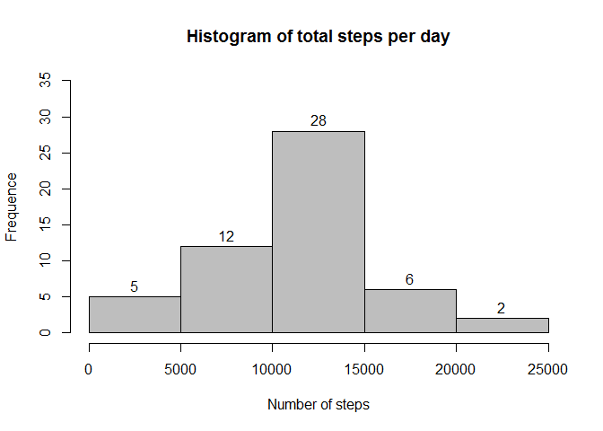
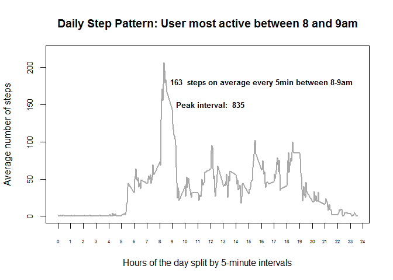
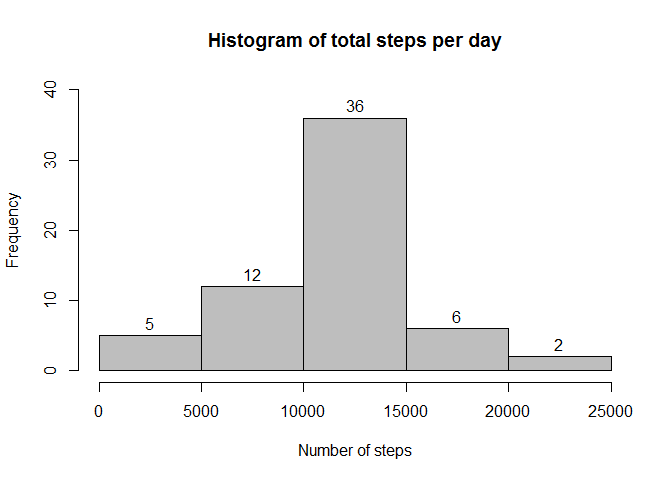
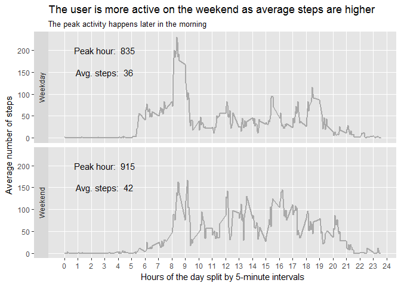

# Reproducable Research. Week 2 Assignment
Created by YZ  
June 12, 2017  


### Part 1. Reading and processing the data

IMPORTANT: The user has two otpions to make the code run:

1. Run all the code from their workding directory where "activity.csv" dataset is located
       
2. Run all the code from the cloned git directory since it already contains the dataset

The below code accomplishes two goals:

1. Loads the data

2. Converts date from factor to date class. This will be necessary for one of the later steps


```r
activity <- read.csv("activity.csv")
activity$date2 <- as.Date(activity$date)
```

### Part 2. Histogram of the total number of steps taken each day

To create a histogram, the first step is to aggregate the dataset:


```r
activity_by_day <- aggregate(steps ~ date, data = activity, sum)

hist(activity_by_day$steps, 
     breaks = 6,
     ylim = c(0,35),
     xlim = c(0,25000),
     labels = TRUE,
     col = "grey",
     main = "Histogram of total steps per day",
     xlab = "Number of steps",
     ylab = "Frequence")
```

<!-- -->

### Part 3. Mean and median number of steps taken each day


```r
round(mean(activity_by_day$steps))
```

```
## [1] 10766
```

```r
round(median(activity_by_day$steps))
```

```
## [1] 10765
```

### Part 4 and 5. Time series plot of the average number of steps taken and the 5-minute interval that, on average, contains the maximum number of steps


```r
# aggregating dataset on the interval level
activity_by_interval <- aggregate(steps ~ interval, data = activity, mean)

# getting max number of steps for Y axis limits
max(activity_by_interval$steps)
```

```
## [1] 206.1698
```

```r
# setting tick marks parameters for Y axis
tickY <- seq(from=0,to=250,by=50)

# getting max interval for the X axis limits
max(activity_by_interval$interval)
```

```
## [1] 2355
```

```r
# setting tick marks parameters for X axis
tickX <- seq(from=0,to=2400,by=100)
tickXlabels <- c(0:24)

# investigating and recording peak activity hours
activity_by_interval$hours <- activity_by_interval$interval / 100
peak_interval <- activity_by_interval[activity_by_interval$steps == max(activity_by_interval$steps),1]
avg_steps_89am <- with(subset(activity_by_interval, activity_by_interval$hours > 8 & activity_by_interval$hours < 9), mean(steps))

# building the plot in in base plotting system
plot(activity_by_interval$interval,
     activity_by_interval$steps,
     type = 'l',
     lwd = 2, 
     col = "darkgrey",
     ylim = c(0,220),
     yaxt = "n",
     xaxt = "n",
     main = "Daily Step Pattern: User most active between 8 and 9am",
     ylab = "Average number of steps",
     xlab = "Hours of the day split by 5-minute intervals")

axis(2, at = tickY, labels = tickY, cex.axis = 0.8)
axis(1, at = tickX, labels = tickXlabels, cex.axis = 0.5)
text(x = 1600, y = 180, 
     label = paste(round(avg_steps_89am)," steps on average every 5min between 8-9am"),
     cex = 0.8,
     font = 2)
text(x = 1200, y = 150, 
     label = paste("Peak interval: ", peak_interval),
     cex = 0.8,
     font = 2)
```

<!-- -->

### Part 6. Code to describe and show a strategy for imputing missing data

How many rows are missing steps data?


```r
sum(is.na(activity))
```

```
## [1] 2304
```

Steps to impute missing data:

1. Load "plyr" package

2. Create a function *impute* to replace missing values with interval means by row

3. Run ddply function to apply the *impute* function to the original data and output new dataset


```r
library(plyr)
```

```
## Warning: package 'plyr' was built under R version 3.3.1
```

```r
impute <- function(x, fun) {
  missing <- is.na(x)
  replace(x, missing, fun(x[!missing]))
}
activity2 <- ddply(activity, ~ interval, transform, steps = impute(steps, mean))
```

### Part 7. Histogram of the total number of steps taken each day after missing values are imputed

The only change in the histogram is the higher frequency of of intervals with mean steps


```r
activity_by_day2 <- aggregate(steps ~ date, data = activity2, sum)

hist(activity_by_day2$steps, 
     breaks = 6,
     ylim = c(0,40),
     xlim = c(0,25000),
     labels = TRUE,
     col = "grey",
     main = "Histogram of total steps per day",
     xlab = "Number of steps",
     ylab = "Frequency")
```

<!-- -->

Mean and median have not changed because the missing values were replaced with interval means


```r
round(mean(activity_by_day$steps))
```

```
## [1] 10766
```

```r
median(activity_by_day$steps)
```

```
## [1] 10765
```

### Part 8. Panel plot comparing the average number of steps taken per 5-minute interval across weekdays and weekends

Create a factor variable with two levels: weekend and weekday


```r
activity2$weekday <- as.factor(ifelse(weekdays(activity2$date2) == "Saturday" |
                             weekdays(activity2$date2) == "Sunday",
                             "Weekend", "Weekday"))
table(activity2$weekday)
```

```
## 
## Weekday Weekend 
##   12960    4608
```

The following code:

1. Creates interval aggregated dataset with imputed missing data

2. Sets X axis tick mark paramters

3. Calculates and records peak intervals for weekend and weekday

4. Calculates and records average steps for weekend and weekday

5. Creates plot with ggplot2 package


```r
activity_by_interval2 <- aggregate(steps ~ interval + weekday, data = activity2, mean)

tickX <- seq(from=0,to=2400,by=100)
tickXlabels <- c(0:24)

peak_interval_WE <- paste("Peak hour: ", round(subset(activity_by_interval2, weekday == "Weekend")[subset(activity_by_interval2, weekday == "Weekend")$steps == max(subset(activity_by_interval2, weekday == "Weekend")$steps),1]))
peak_interval_WD <- paste("Peak hour: ", round(subset(activity_by_interval2, weekday == "Weekday")[subset(activity_by_interval2, weekday == "Weekday")$steps == max(subset(activity_by_interval2, weekday == "Weekday")$steps),1]))

activity_by_interval2$hours <- activity_by_interval2$interval / 100

avg_steps_WE <- paste("Avg. steps: ", round(with(subset(activity_by_interval2, weekday == "Weekend"), mean(steps))))
avg_steps_WD <- paste("Avg. steps: ", round(with(subset(activity_by_interval2, weekday == "Weekday"), mean(steps))))


facet_labels_WE <- data.frame(interval = 300, steps = c(150,200), 
                              weekday = factor("Weekend", levels = c("Weekend", "Weekday")),
                              text = c(avg_steps_WE, peak_interval_WE))

facet_labels_WD <- data.frame(interval = 300, steps = c(150,200), 
                              weekday = factor("Weekday", levels = c("Weekend", "Weekday")),
                              text = c(avg_steps_WD, peak_interval_WD))

library(ggplot2)
```

```
## Warning: package 'ggplot2' was built under R version 3.3.3
```

```r
q <- ggplot(activity_by_interval2, aes(interval, steps))

q + geom_line(colour = "darkgrey", lwd = 1) + 
    facet_grid(weekday~. , switch = "y") + 
    ggtitle(
        "The user is more active on the weekend as average steps are higher",
        subtitle = "The peak activity happens later in the morning"
        ) + 
    xlab("Hours of the day split by 5-minute intervals") +
    ylab("Average number of steps") +
    theme(
        panel.background = element_rect(fill = "grey90"),
        panel.grid.minor = element_blank()) +
    scale_x_continuous(
        breaks = tickX,
        label = tickXlabels
    ) +
    geom_text(data = facet_labels_WE, aes(label = text)) +
    geom_text(data = facet_labels_WD, aes(label = text))
```

<!-- -->
